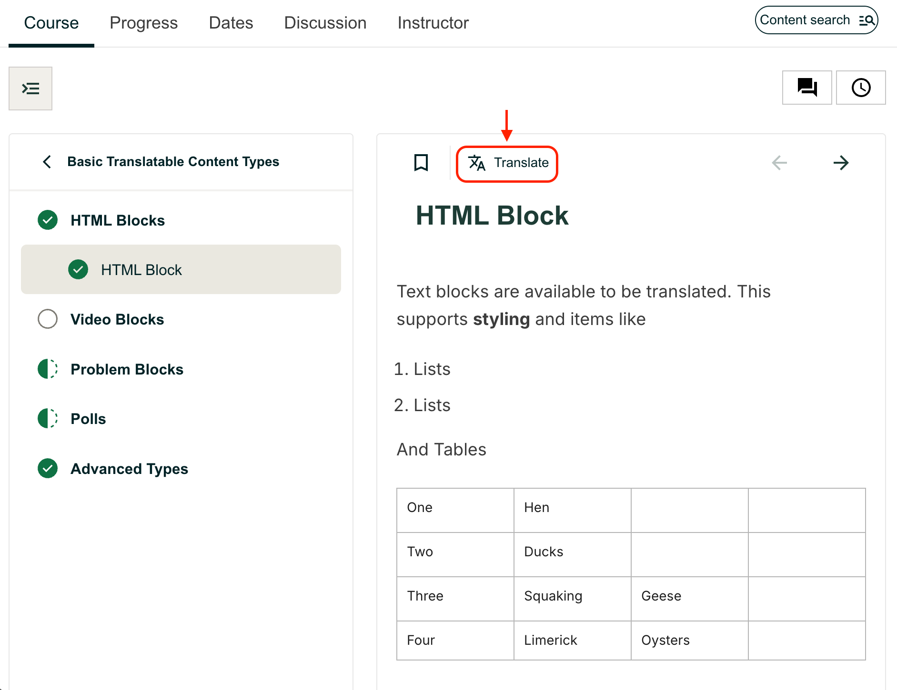
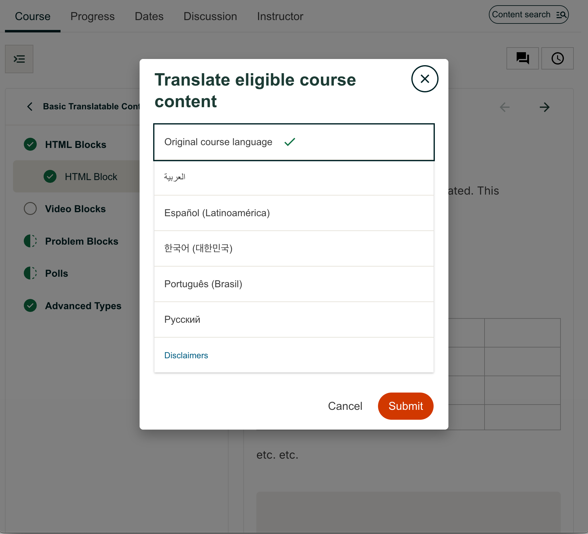

.. _Feature_Description_Xpert_Course_Translations:

##############################################
Feature Description: Xpert Course Translations 
##############################################

Xpert Course Translations (XT) is a set of features enabling certain types of course content to be automatically translated into different languages.

Currently supported content types include:

- **Video transcripts**, where an original English transcript exists.

- **Unit page content**, including HTML, Problems, and Polls.

************************************
Selecting a Language for Translation
************************************

If Xpert Course Translations are enabled in your course, a new "Translate" button will appear (pictured below). Clicking the button opens a modal with languages available for translation. 

|

|

.. note::
  Note that available language options may differ by course.

Once you have selected a language for translation, supported content types will be translated into the target language.

.. note::
  Content is translated on-demand. If you are the first learner to translate a particular piece of course material, you may experience a slight delay while the content is being translated.

**********************
Resetting Translations
**********************

You can turn off translatiions by clicking the "Translate" button again and selecting "Original course language".
