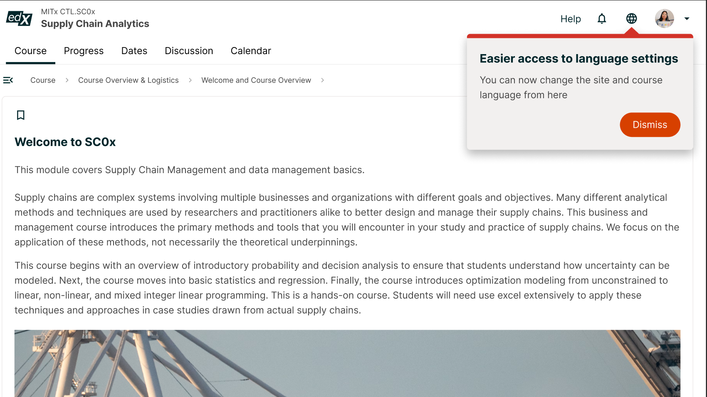
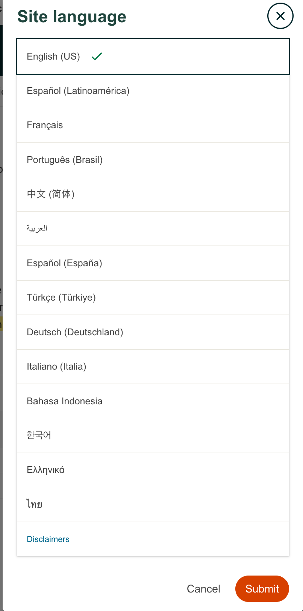

.. _Feature_Description_Xpert_Course_Translations:

##############################################
Feature Description: Xpert Course Translations
##############################################

Xpert Course Translations (XT) is a set of features enabling certain types of course content to be automatically translated into different languages.

Currently supported content types include:

- Video transcripts, where an original English transcript exists.
- Unit page content, including HTML, Problems, and Polls.

For notes and limitations regarding the supported content types, see :ref:`Feature Limitations: Xpert Course Translations <Feature_Limitations_Xpert_Course_Translations>`.

.. _Selecting_a_Language_for_Translation:

*************************************
Selecting a Language for Translation
*************************************

If Xpert Course Translations are enabled in your course, a new globe icon will appear in the top bar of the in-course experience (pictured below).

|

Students within your course can click the button to open a modal with languages available for translation.

|

Once a student has selected a language for translation, supported content types will be translated into the target language.

.. note::
   Content is translated on-demand. The first time a particular piece of course material is translated, there may be a slight delay in page loading before translated material is returned.

.. _Resetting_Translations:

*********************
Resetting Translations
*********************

Students can view original non-translated content either by clicking the globe icon again and selecting the original language, or by clicking on the new translation icon that appears when translations are enabled (pictured below).

.. image:: ../../images/xpert_translations_reset_icon.png
   :alt: Course page showing the translation reset icon
   :align: center
