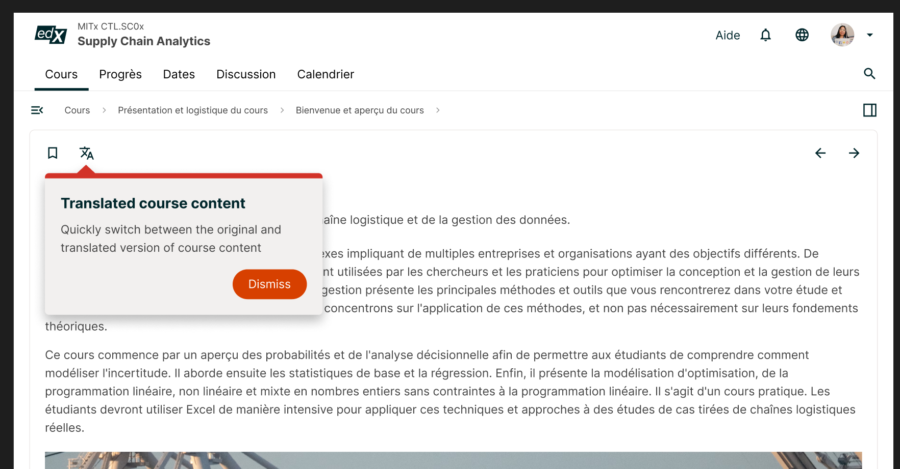

.. _Feature_Description_Xpert_Course_Translations:

##############################################
Feature Description: Xpert Course Translations
##############################################

Xpert Course Translations (XT) is a set of features enabling certain types of course content to be automatically translated into different languages.

Currently supported content types include:

- Video transcripts, where an original English transcript exists.
- Unit page content, including HTML, Problems, and Polls.

.. only:: Partners

   For notes and limitations regarding the supported content types, see :ref:`Feature Limitations: Xpert Course Translations <Feature_Limitations_Xpert_Course_Translations>`.

.. _Selecting_a_Language_for_Translation:

*************************************
Selecting a Language for Translation
*************************************

Course translations are controlled by your site language. This can be changed with the globe icon in the top bar of the in-course experience (pictured below).

.. image:: ../../images/xpert_translations_globe_icon.png
   :alt: Course top bar showing the Xpert translations globe icon
   :align: center

|

Clicking on this icon opens a modal which allows users to set their site language preference directly from within their course.

.. image:: ../../images/xpert_translations_language_modal.png
   :alt: Language selection modal showing available translation languages
   :align: center

|

If a course supports unit translation and a user has selected a language other than English, a translation button will appear at the top of the unit. :ref:`Supported content types <Feature_Limitations_Xpert_Course_Translations>` will be automatically translated to their site language. For enabling or disabling the feature across a course, see :ref:`Enabling or Disabling Translations <Enabling_or_Disabling_translations>`.

|

.. note::
   Content is translated on-demand. The first time a particular piece of course material is translated, there may be a slight delay in page loading before translated material is returned.

.. _Resetting_Translations:

**********************
Resetting Translations
**********************

Students can reset course material to its original language, disabling unit translations, by clicking this translation button and selecting "Original course language".

.. image:: ../../images/xpert_translations_reset_icon.png
   :alt: Course page showing the translation reset icon
   :align: center
